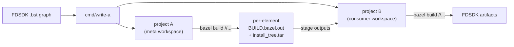
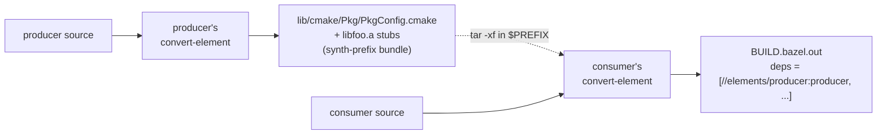

# Architecture in five minutes

## The problem

[BuildStream](https://www.buildstream.build/) drives the FreeDesktop
SDK build today — every package builds in a sandbox via the `bst`
runtime, dependencies flow through an opaque install-tree archive,
and the build graph is recovered from a YAML element catalogue (one
`.bst` per package). We want the same artifacts under
[Bazel](https://bazel.build/), with native `cc_library` /
`cc_binary` rules so Bazel's incremental build, remote execution,
and remote cache see the FDSDK at fine grain.

## The two-pass shape

The conversion runs in two Bazel workspaces, generated together:

- **Project A** holds one Bazel package per element. Each package's
  `BUILD.bazel` is a small genrule that invokes the per-kind
  translator (e.g. `convert-element` for `kind:cmake`,
  `convert-element-autotools` for `kind:autotools`) on the element's
  source tree. The genrule's output is a real `BUILD.bazel.out` —
  native cc rules — plus any cross-element side-channels (cmake
  config bundles, install-tree tarballs).

- **Project B** is the consumer-facing Bazel workspace. Its
  per-element `BUILD.bazel` is staged from project A's
  `BUILD.bazel.out` after `bazel build` over project A. Once staged,
  `bazel build //...` over project B compiles the FDSDK with native
  cc rules — no BuildStream / `bst` dep at runtime.

`cmd/write-a` is the static renderer. It parses the `.bst` graph,
resolves `depends:` edges, dispatches per `kind:`, and emits both
workspaces' `MODULE.bazel` / per-element `BUILD.bazel` /
filegroup / config_setting plumbing. It does **not** invoke Bazel
or run any builds itself.

## Per-kind conversion paths

Two paths today, with parallels:

```mermaid
flowchart TB
    subgraph CMAKE [kind:cmake — File-API-driven]
        CSRC["cmake source"] --> CCMAKE["cmake configure<br/>(File API + trace)"]
        CCMAKE --> CCONV["convert-element<br/>(lower + emit)"]
        CCONV --> CBUILD["BUILD.bazel.out<br/>(cc_library / cc_binary)"]
    end
    subgraph AUTO [kind:autotools — trace-driven]
        ASRC["autotools source"] --> ATRACE["build-tracer<br/>(ptrace wrap)"]
        ATRACE -- "configure + make + install" --> ATRACE2["execve trace"]
        ATRACE2 --> ACONV["convert-element-autotools<br/>(parse + correlate)"]
        ACONV --> ABUILD["BUILD.bazel.out<br/>(cc_library / cc_binary)"]
    end
```

- **`kind:cmake`** uses cmake's structured introspection: the File
  API gives us the codemodel + cmakeFiles; `cmake --trace-expand`
  gives us PUBLIC/PRIVATE keyword arms, `target_link_libraries`,
  `configure_file` calls. The lower pass folds them into the IR;
  the emitter writes native cc rules. See
  [docs/cmake-conversion-deltas.md](cmake-conversion-deltas.md) for
  what's solved (visibility, configure_file, find-package STATIC,
  multi-language split, ...) and what's open (subdir-library
  cosmetic over-broad hdrs).

- **`kind:autotools`** has no codemodel-equivalent introspection.
  Instead, the install genrule wraps `./configure && make && make
  install` under `cmd/build-tracer`, which captures every successful
  execve via ptrace. `cmd/convert-element-autotools` reads the
  trace, classifies events into compile / link / archive,
  cross-correlates them (compile output `.o` paired with archive +
  link), and emits native `cc_library` / `cc_binary`. See
  [docs/trace-driven-autotools.md](trace-driven-autotools.md) for
  the architecture.

Both paths emit `BUILD.bazel.out` in the same shape: native cc rules
that `bazel build` consumes inside project B.

## Cross-element data flow

`kind:cmake` elements share more than just install trees — they
publish a synthesized cmake-config bundle (the analog of
`install(EXPORT)`) so downstream `find_package(<Pkg> CONFIG)` calls
resolve at the consumer's convert-time:

The consumer's genrule lists every cmake dep's
`cmake_config_bundle` filegroup as a srcs entry, extracts each tar
into a shared `$PREFIX`, and passes `--prefix-dir=$PREFIX` to
convert-element. cmake's `find_package(<Pkg> CONFIG)` then resolves
against the staged tree. `internal/synthprefix` builds the per-bundle
layout (lib/cmake/<Pkg>/*.cmake + zero-byte stubs at every
IMPORTED_LOCATION path so `if(NOT EXISTS)` checks pass).

For autotools elements the same cross-element story holds via the
imports manifest: link command's `-l<name>` flags resolve to
`//elements/<name>:<name>` Bazel labels through
`manifest.LookupLinkLibrary`.

## Convergence + caching

Both passes write everything through Bazel's action cache:

- **Project A** caches its render genrules. New `.bst` source →
  new srckey → cache miss → genrule re-runs. Same source +
  same translator version → cache hit, action result reused
  across nodes via the existing remote-cache backend (buildbarn in
  CI, Bazel local cache for dev).
- **Project B** caches its compile / link actions just like any
  other Bazel cc_binary build.

There's no separate srckey-keyed registry. The cache backend
(buildbarn) IS the convergence point — same source + same toolchain
+ same converter version → same action key → same outputs,
deterministically shared across all builders.

## Where things live

| Component | Path | Role |
|---|---|---|
| Static renderer | `cmd/write-a/` | `.bst` → project A + project B BUILD files |
| cmake converter | `cmd/convert-element` (`converter/cmd/convert-element/`) | cmake source → BUILD.bazel.out |
| Process tracer | `cmd/build-tracer/` | Wraps build cmd; emits execve trace |
| autotools converter | `cmd/convert-element-autotools/` | Trace → BUILD.bazel.out |
| Cross-element synth | `internal/synthprefix/` | Builds the cmake-config-bundle layout |
| Imports manifest | `internal/manifest/` | Cross-element name → Bazel label resolution |
| End-to-end gates | `scripts/meta-*.sh`, `Makefile e2e-*` | Drive the pipeline against fixtures |
| Fixtures | `testdata/meta-project/`, `converter/testdata/` | Hello-world up through full FDSDK probes |

## Where to look next

- **Just trying it**: [README.md quick start](../README.md#quick-start).
- **Generated workspace shape (interop contract)**:
  [docs/build-structure.md](build-structure.md). Read this if
  you're writing a sibling .bst → Bazel converter or a
  consumer of the generated workspaces.
- **Project plan**: [docs/whole-project-plan.md](whole-project-plan.md).
- **Per-kind conversion details**:
  [docs/cmake-conversion-deltas.md](cmake-conversion-deltas.md),
  [docs/trace-driven-autotools.md](trace-driven-autotools.md).
- **Repo today (binaries, packages, data flow)**:
  [docs/architecture.md](architecture.md).
